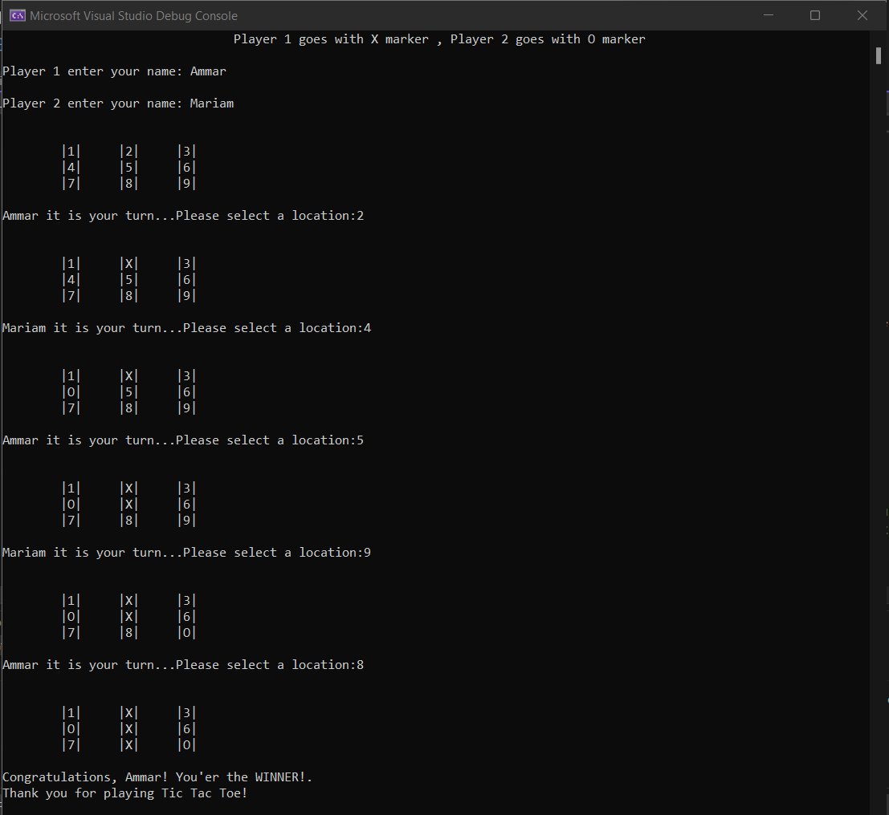

# TicTacToe

TicTacToe is a classic board game played on a 3x3 grid, where two players take turns marking X's and O's to form a line of three symbols horizontally, vertically, or diagonally. It's a simple yet engaging game that requires strategy and quick thinking to outwit your opponent.

# Visuals

# How to use!

To play TicTacToe, follow these steps:

1- Clone the repository or download the source code.
Open the project in your preferred development environment (e.g., Visual Studio).

2- Build the solution to ensure all dependencies are resolved.

3- Run the application.

4- The game will prompt for players to insert their names and assign 'X' and 'O' symbols to each player.

5- The game board will be displayed, and players will take turns entering their moves.

6- Enter the number corresponding to the desired position on the grid (1-9).

7- The game will update the board and continue until a winner is determined or the game ends in a draw.

8- The final result (winner or draw) will be displayed, and players can choose to play again or exit the game.